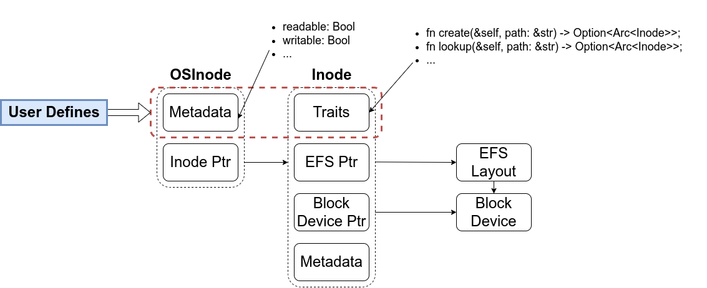

## CH6

### EasyFS

#### Block

```rust
pub trait BlockDevice: Send + Sync + Any {
    fn read_block(&self, block_id: usize, buf: &mut [u8]);
    fn write_block(&self, block_id: usize, buf: &[u8]);
    fn handle_irq(&self);
}
```

- 需要外部提供块设备驱动，对块缓存层暴露根据块号读写块设备的接口。
- 这个部分不需要改动，目前已经可以和块设备驱动模块进行交互，具备灵活性和泛用性。

```rust
pub struct BlockCache {
    cache: Vec<u8>,
    block_id: usize,
    block_device: Arc<dyn BlockDevice>,
    modified: bool,
}
```

- 缓冲区的生命周期结束后其占用的内存空间会被回收，同时根据脏位判断是否要写回块设备。
- 这个部分可以考虑不同的查找和替换算法，目前 `BlockCacheManager` 默认实现了  `get_block_cache` 方法；实现其他算法的关键在于使用的数据结构，可以利用 Rust 的泛型机制。


#### Layout

```txt
+------------+--------------+-------+-------------+------+
| SuperBlock | Inode Bitmap | Inode | Data Bitmap | Data |
+------------+--------------+-------+-------------+------+
```

- 往年留给同学们的实验是硬链接，需要修改文件系统内的 Inode 结构，增加持久化的链接数量信息。模块化的设计不太容易支持这种结构本身的修改，所以如果保留该实验题目，应该预先给出完整的结构体，不要求同学们修改这一部分。
- 目前大部分实现不需要改动，与 `BlockCacheManager` 的交互已经很好地屏蔽了内部信息。

#### VFS

改动的主体，需要对暴露的接口进行修改和完善来实现更好的抽象。

```rust
pub struct Inode {
    block_id: usize,
    block_offset: usize,
    fs: Arc<Mutex<EasyFileSystem>>,
    block_device: Arc<dyn BlockDevice>,
}
```

- `Inode`结构是暴露给上层的，可以让调用者对文件和目录进行直接操作。
- 目前的文件系统默认是扁平化的设计，无法访问多级目录，为了增加灵活性，可以将一部分查找接口暴露给上层进行定义和使用:

```rust
pub trait InodeManager {
  /// 根据路径创建索引节点，成功则返回节点指针
  fn create(&self, path: &str) -> Option<Arc<Inode>>;
  /// 根据路径查找索引节点，成功则返回节点指针
  fn lookup(&self, path: &str) -> Option<Arc<Inode>>;
  /// 根据源路经和目标路径建立硬链接，成功则返回节点指针
  fn link(&self, src: &str, dst: &str) -> Option<Arc<Inode>>;
  /// 根据路径删除链接
  fn unlink(&self, path: &str);
  // 根据路径读取目录，成功则返回目录内部的节点
  fn readdir(&self, path: &str) -> Option<Vec<Arc<Inode>>>;
  /// 之后还可以根据需要定义接口，目前实验用不到那么多
  /// 可以参考 Fuse 文档扩展设计
}
```

其余默认提供的接口包括：

```rust
impl Inode {
  /// 泛型读写方法简化对于磁盘上`DiskInode`的访问流程
  fn read_disk_inode<V>(&self, f: impl FnOnce(&DiskInode) -> V) -> V;
  fn modify_disk_inode<V>(&self, f: impl FnOnce(&mut DiskInode) -> V) -> V;
  /// 根据传入的偏移量对数据进行读写
  pub fn read_at(&self, offset: usize, buf: &mut [u8]) -> usize;
  pub fn write_at(&self, offset: usize, buf: &[u8]) -> usize;
  pub fn clear(&self)；
}
```

总体设计结构如图所示：

