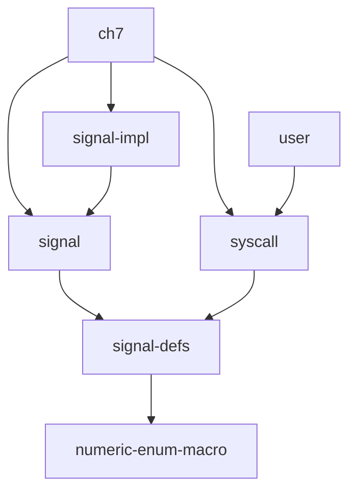

# 第七章

已提供信号部分的用户库接口及测例，但内核没有相关实现

## 主体实现

目前 `/ch7` 模块复制自 `/ch6`，已经有了基本的信号实现。

在 `/xtask/src/user.rs` 和 `/user/cases.toml` 中加入了第七章相关信息。

### 新增模块

目前新增加了四个模块：

- `signal-defs` 模块。包含每个信号标号的具体含义 `enum SignalNo`和信号处理函数的定义 `struct SignalAction`。`syscall`模块需要它们，而信号的接口模块`signal`也需要它们。**考虑到 `syscall` 和 `signal` 谁依赖谁都不太合适，所以单独拆了一个非常简单的 `signal-defs` 出来，专门存放用户程序和内核都需要使用的信号定义**

- `signal`模块。信号模块的定义，主要提供`pub trait Signal`

- `signal-impl`模块。一个信号模块的参考实现。

- `ch7`模块。第七章的主线代码。

它们（和部分已有模块）的依赖关系如下：



其中 `numeric-enum-macro` 是一个外部库，提供了 `enum` 和整数类型之间的表达和转换关系。

## 用户测例

添加测例：`sig_ctrlc` `sig_simple` `sig_simple2` `sig_tests`，其中 `sig_ctrlc` `sig_simple` `sig_simple2` 可通过。

目前仅添加了信号相关的测例，后续还会加入其他测例。

（本项目与原 `rCore-Tutorial-v3`对用户程序的部分接口有所不同，因此引入时会修改部分代码）

## 信号部分

目前已在 `/syscall/src/user.rs` 添加用户库对应需要的 syscall：

- `kill` 发送信号
- `sigaction` 设置信号处理函数
- `sigprocmask` 修改信号掩码
- `sigreturn` 从信号处理函数中返回

并添加 `/signal-defs`，包含一些用户程序和内核通用的信号标号和处理函数定义。

> 这里 `SignalAction::mask` 使用 `usize` 而非 `i32`，是为了兼容将来可能会有的标号在 `[32,64)` 之间的实时信号。
> 
> 这里信号标号使用 `SignalNo`，是为了与上面的 `mask` 区分，提示用户程序在 `kill()` 和 `sigaction()` 中应使用信号的标号，而在 `sigprocmask` 中应使用信号的掩码

### 额外添加的 syscall 和代码

由于信号模块依赖一些前面章节的 syscall，但它们还没有实现，所以这里也添加和修改了一些信号之外的 syscall 和代码：

- 添加 `syscall: getpid`，应属于第五章。

- 添加 `/user/src/lib.rs: sleep(period_ms: usize)` ，应属于第三章。这里为了适应用户程序，还在 `/syscall/lib/time.rs` 中添加了从毫秒数(`usize`)转换为 `TimeSpec`的方法

- 添加 `/ch7/src/exit_process.rs` 这个方法实际上是原来的 `sys_exit` 。因为“进程退出”这一事件除了由 `sys_exit` 触发，也可能由信号触发，因此现在把这个过程抽离出来，其他事情发生时也会

## 后续工作的依赖问题

前面章节还有一些工作没有完成，而第七章的部分内容恰好对这些没完成的部分有依赖，因此目前功能还不够全面：

- 缺少时钟中断，所以还不支持暂停应用的信号

- 缺少 trait File，目前所有文件都来自fs，而stdin/stdout 是靠特判实现的，所以pipe还需要等一会

- 第五章实现中，进程状态简化了，现在没法保存和获取进程退出时的 exit_code，wait 的非负数返回值只能使 333。但是信号相关的部分测例 `sig_tests`是需要检测退出时的返回值的。

- 之前的rCore-Tutorial是有“用户程序阻塞在内核态”的机制的，比如说暂停的信号和pipe，即可能出现

```rust
loop {

    if ......
        suspend_current_and_run_next();

}
```

的情况，但是现在的 `kernel-context` 似乎不支持这个机制了。这样上述的功能都需要重新考虑如何实现

（顺便一提，本来 `stdin` 的串口输入也是需要这个机制的，但现在似乎整个内核会阻塞在`sbi_rt::legacy::console_getchar()` 上，把问题绕过去了）